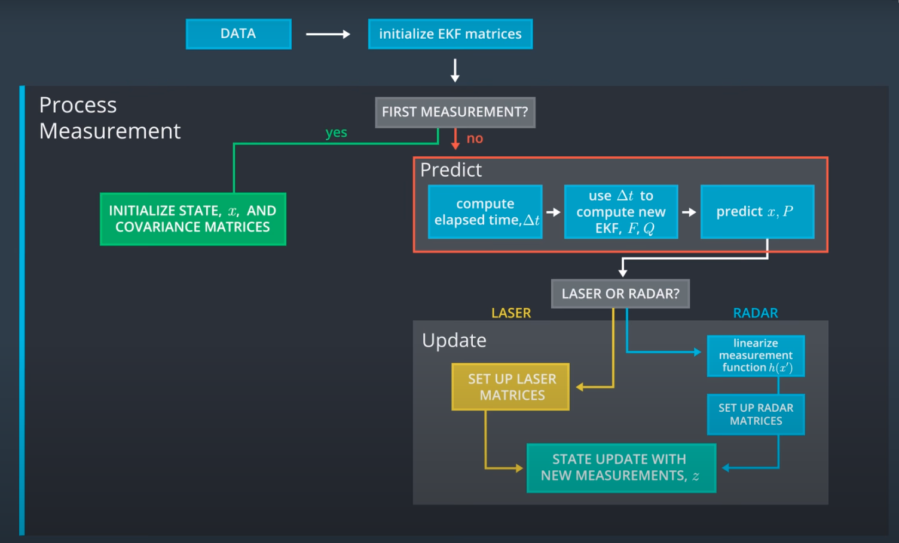
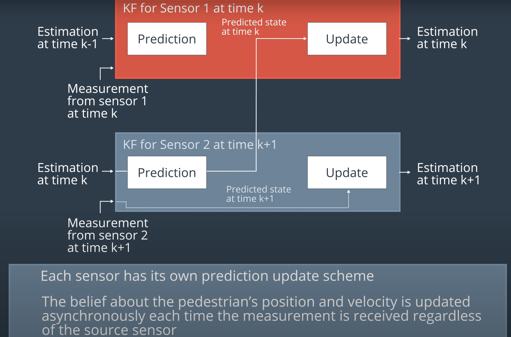
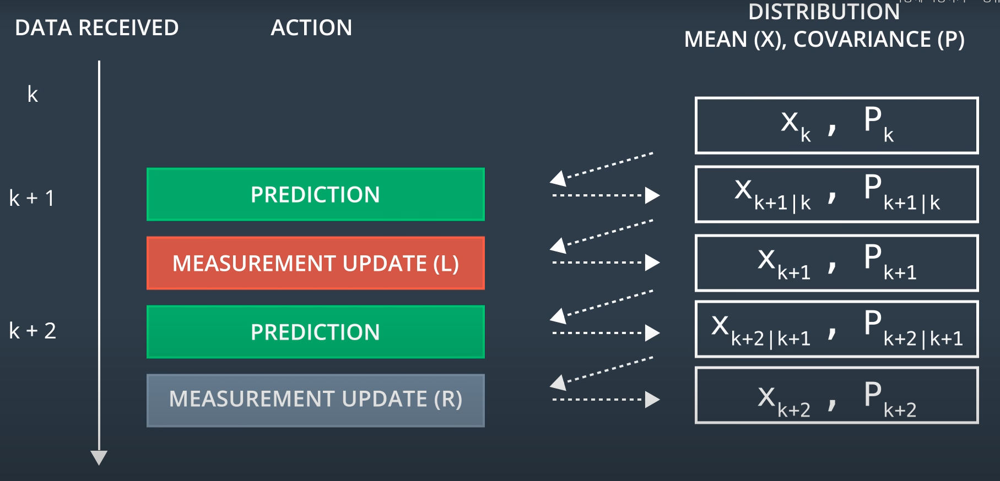

# Extended Kalman Filter Project Starter Code

> Author: SungwookLE  
 DATE: '21.9/14  
 Comment: Radar+Lidar Sensor Fusion Project on Udacity(Self-Driving Car Engineer Nanodegree Program)  

In this project you will utilize a kalman filter to estimate the state of a moving object(`pedestrian`) of interest with noisy **lidar and radar** measurements. Passing the project requires obtaining RMSE values that are lower than the tolerance outlined in the project rubric. 

---

## 1. Pre-requires
1) Simulator: Term 2 Simulator which can be downloaded [here](https://github.com/udacity/self-driving-car-sim/releases)
2) Communication Protocol Between Simulator and Your program: This repository includes two files that can be used to set up and install [uWebSocketIO](https://github.com/uWebSockets/uWebSockets) for either Linux or Mac systems. Please see the uWebSocketIO Starter Guide page in the classroom within the EKF Project lesson for the required version and installation scripts.  

## 2. Other Dependencies

* cmake >= 3.5
  * All OSes: [click here for installation instructions](https://cmake.org/install/)
* make >= 4.1 (Linux, Mac), 3.81 (Windows)
  * Linux: make is installed by default on most Linux distros
  * Linux: gcc / g++ is installed by default on most Linux distros

## 3. Basic Build Instructions

1. Make a build directory: `mkdir build && cd build`
2. Compile: `cmake .. && make` 
   * On windows, you may need to run: `cmake .. -G "Unix Makefiles" && make`
3. Run it: `./ExtendedKF `

## 4. Introduction
### 4-1. Input/Output Description  
 1) **INPUT**: values provided by the simulator to the c++ program  
- ["sensor_measurement"] => the measurement that the simulator observed (either lidar or radar)
- 1-1) Lidar Data

- 1-2) Radar Data
  
레이더 데이터는 `radial velocity, radial distance, radial degree`를 제공하므로 극좌표계를 수직좌표계로 변환하는 과정에서 `non-linearity`가 발생한다. 이 수식을 선형화해서 풀어야하고, 이런 방식으로 접근하는 것을 **Extended Kalman Filter**라고 한다. 
- 1-2-1) Linearlization
  
보이다시피, 현재 시점의 $\mu$값을 기준으로 선형화를 해야한다. : `perturbation`.  
현재 시점이 0이라고 했을 때 h(x) = arctan(x) 의 테일러 1차 전개를 이용한 선형화 [예시](assets/linearization_example.png).

 2) **OUTPUT**: values provided by the c++ program to the simulator  
- ["estimate_x"] <= kalman filter estimated position x
- ["estimate_y"] <= kalman filter estimated position y
- ["rmse_x"]
- ["rmse_y"]
- ["rmse_vx"]
- ["rmse_vy"]

### 4-2. Sensor Fusion Flow Diagram

- The car will receive another sensor measurement after a time period Δt. The algorithm then does another **predict and update** step.

- Lidar and Radar Sensor Fusion Flow in Kalman Filter
서로 다른 좌표계를 갖는 센서 데이터: Lidar(L)와 Radar(R) 를 받음에 따라 그에 맞는 칼만 업데이트(`update correctness`)를 해주면 되고, 업데이트 된 값을 기준으로 매스탭마다 `prediction`을 수행한다.
  
  
위 그림과 달리 Lidar와 Radar가 동시에 수신된다면, Update를 2번 해주면 된다. 무얼 먼저 update 과정을 거칠 것인지는 상관 없음.  

- Radar 데이터의 경우 `radial velocity, radial distance, radial degree`가 출력되므로 이를 직교 좌표계로 바꾸는 과정에서 비선형 수식이 등장한다. 이를 해결하기 위해 `Extended Kalman Filter`를 이용해야 하고 `EKF`의 수식은 Linear Kalman Filter와 정확히 똑같지만, F와 H를 자코비안(테일러 1차) 선형화된 매트릭스로 대체하여 사용하는 것에 차이가 있다.  

- Extended Kalman Filter Equations
 Although the mathematical proof is somewhat complex, it turns out that the Kalman filter equations and extended Kalman filter equations are very similar. The main differences are:  
  - the F matrix will be replaced by $F_j$ when calculating `P'`. 
  - the H matrix in the Kalman filter will be replaced by the `Jacobian` matrix $H_j$ when calculating `S, K, and P`.
  - to calculate `x'`, the prediction update function, $f$, is used instead of the F matrix.
  - to calculate `y`, the $h$ function is used instead of the H matrix.
  - **One important point to reiterate is that the equation $y = z - Hx'$ for the Kalman filter does not become $y = z - H_jx$ for the extended Kalman filter. Instead, for extended Kalman filters, we'll use the $h$ function directly to map predicted locations $x'$ from Cartesian to polar coordinates.**

  ## 5. Implementation
  